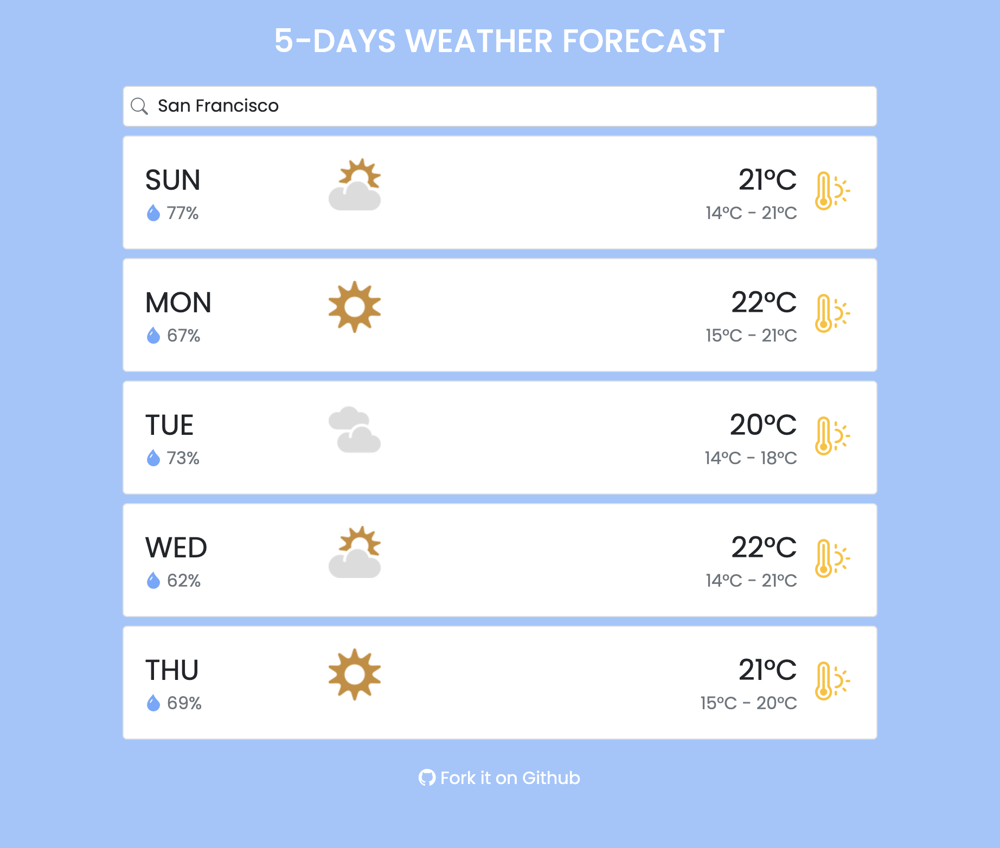
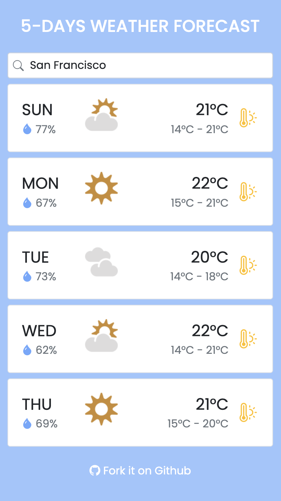
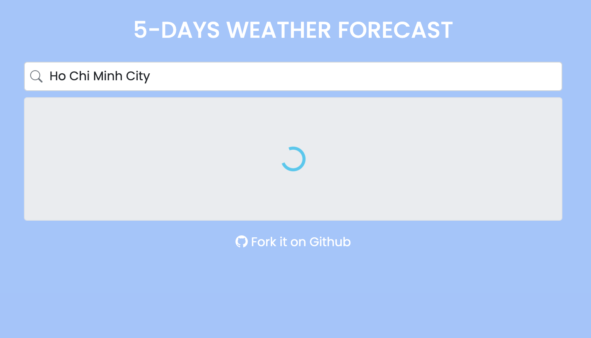
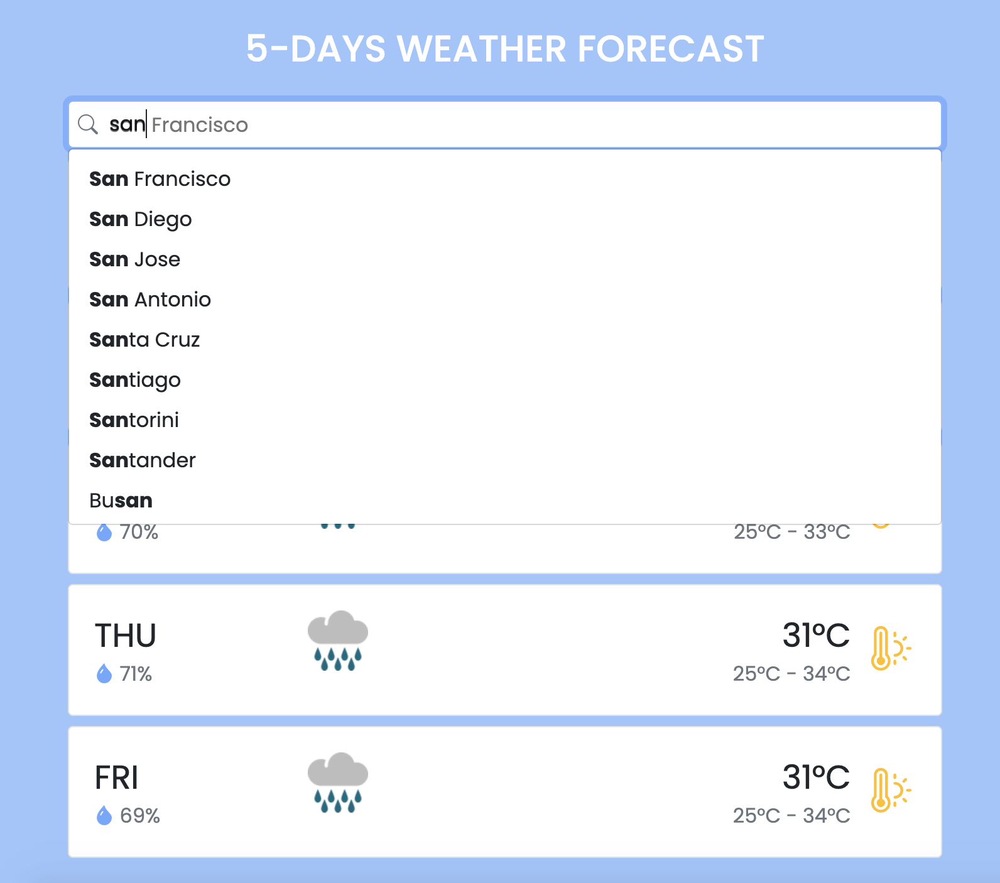

# 5-Days Weather Forecast with React

Desktop               |  Mobile
:-------------------------:|:-------------------------:
|

A simple web application which consumes data from [MetaWeather](https://www.metaweather.com/) and visualizes 5 days forecast of a city.

The application starts with a request to MetaWeather to fetch forecast data for the initial location (Ho Chi Minh city). During the request, a loading screen is displayed. Once data has been fetched, the forecast data will be visualized in rows with each row contains some basic information like weekday, humidity, weather state icon, temperatures. In addition, the application also supports a searchbox which can suggest matched cities when typing a keyword, the suggestion options is also based an API from MetaWeather.

## Screenshots:
### 1. Loading screen


### 2. Type ahead / Suggestion


## Pre-requisites
```
Node >= 10.16 and npm >= 5.6
```

## Run
1. Clone this repository
1. run `yarn`
1. run `yarn start`
1. A Browser will open a new tab and navigate to `localhost:3000`

## Test
```
yarn test
```

## Technical Stack

* [React](https://facebook.github.io/react/) - A View Library
* [Redux](http://redux.js.org/) - JavaScript State Container
* [Redux Saga](https://redux-saga.js.org/) - A Side-effect middleware for Redux
* [Axios](https://github.com/mzabriskie/axios) - A promise based HTTP client
* [create-react-app](https://github.com/facebookincubator/create-react-app) - Create React apps with no build configuration.
* [react-intl](https://formatjs.io/docs/react-intl/) - Setup internationalization (translation, format number, ...)
* [MetaWeather](https://www.metaweather.com/) - Weather API for Developers
* [React Boostrap](https://react-bootstrap.github.io/) - A front-end framework rebuild for React
* [Immer](https://github.com/immerjs/immer) - Handle immutable state tree
* ...

## Authors

* **Liep Nguyen** - [Github](https://github.com/liepvn)

## License

This project is licensed under the MIT License
